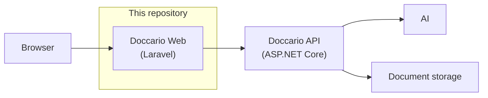
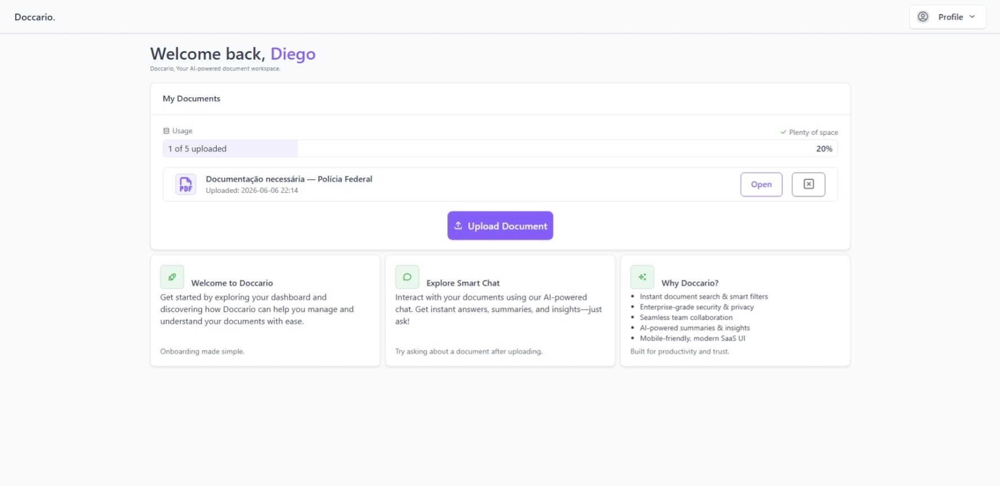
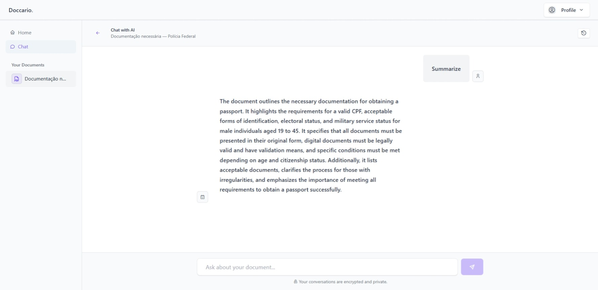
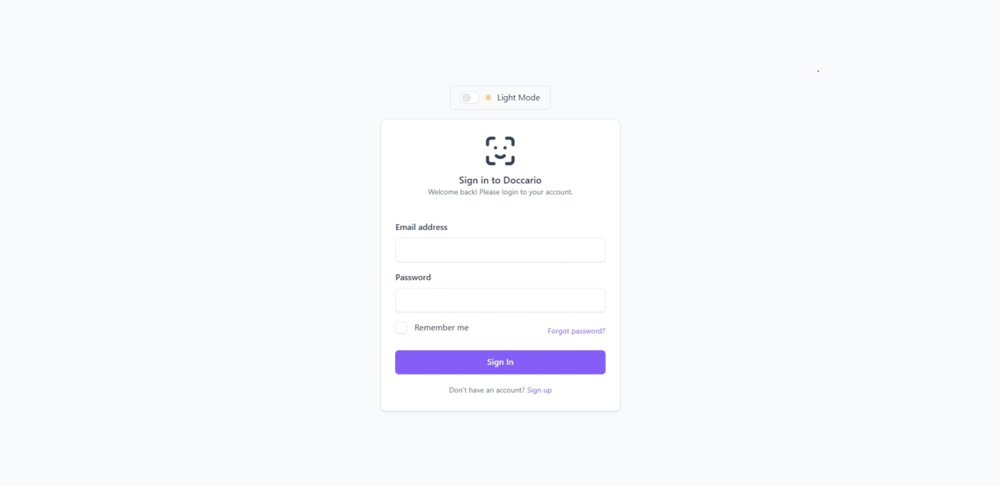
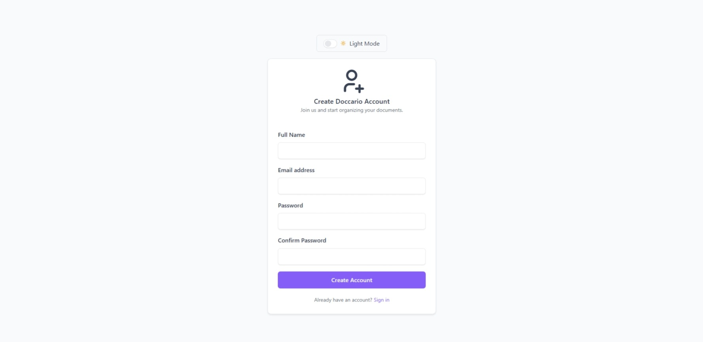
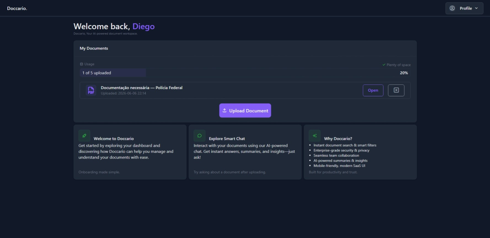
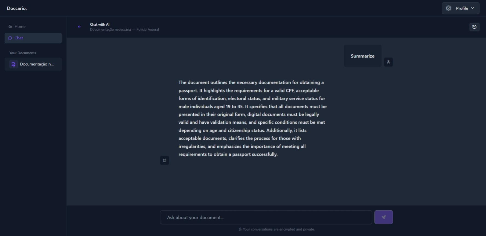
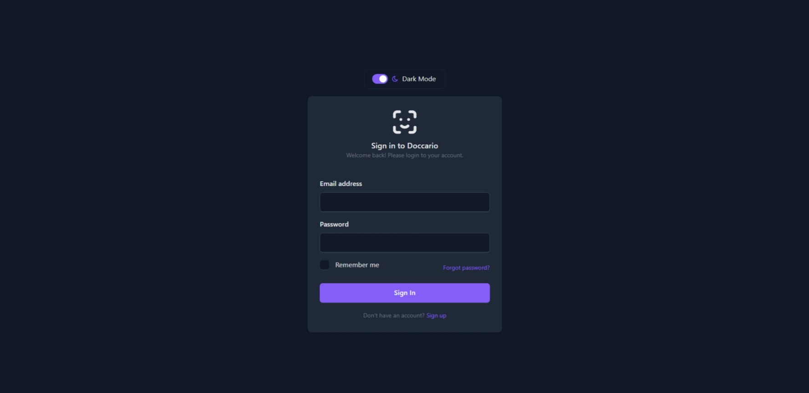
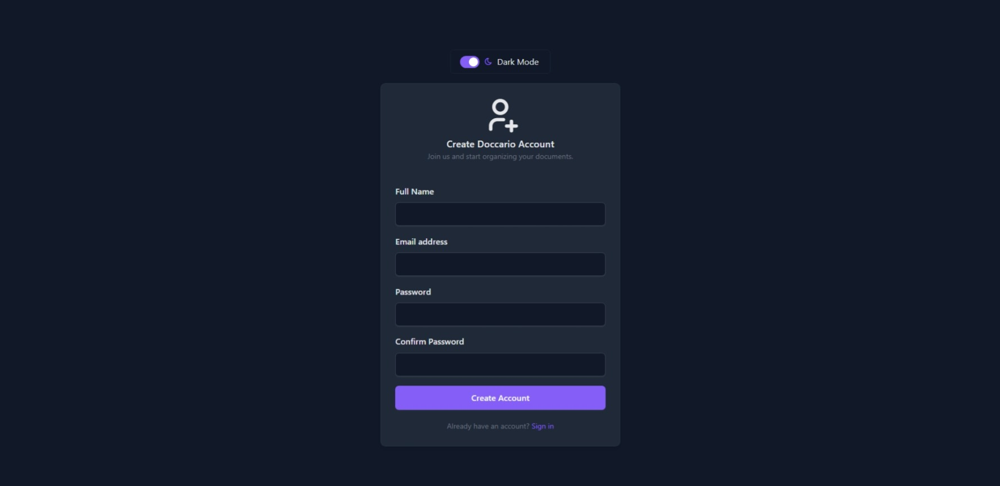

# Doccario Web

<p align="center">
  
  
  
  
  
  
</p>

**An AI-powered document workspace — modern SaaS frontend built with Laravel.**

Doccario lets users upload PDF documents and chat with them using AI. Ask questions, get summaries, and extract insights from your files through a clean interface.

This repository is the **presentation layer** of the Doccario platform. It is intentionally thin: no business logic, no database access, and no AI processing live here. The app renders UI, manages auth state, and communicates with a separate **ASP.NET Core API** that handles documents, conversations, and AI orchestration.

---

## Why this project matters

Doccario was built to mirror how real SaaS products are structured in production:

- **Separation of concerns** — frontend and backend are decoupled services
- **API-first design** — every feature flows through a REST API
- **Security-conscious auth** — JWT access tokens, refresh tokens, and secure HTTP-only cookies
- **Polished UI** — responsive dashboard with light/dark mode, reusable Blade components, and mobile support

---

## Features

| Area                    | What it does                                                             |
| ----------------------- | ------------------------------------------------------------------------ |
| **Authentication**      | Sign up, log in, logout with session or persistent "remember me" cookies |
| **Document management** | Upload PDFs, view usage quotas, open or delete documents                 |
| **AI chat**             | Clean styled interface per document, with streaming responses            |
| **Dashboard**           | Welcome view with document list, storage usage, and onboarding cards     |
| **Theme**               | Light/dark mode with Tabler's design system                              |
| **Resilience**          | Automatic token refresh, graceful handling when the API is unavailable   |

---

## Tech stack

| Layer                   | Technologies                                         |
| ----------------------- | ---------------------------------------------------- |
| **Backend (this repo)** | PHP 8.2+, Laravel 12                                 |
| **Templating**          | Blade, reusable view components                      |
| **UI**                  | Tabler UI, Bootstrap 5, Tabler Icons                 |
| **Interactivity**       | Alpine.js                                            |
| **Assets**              | Vite 7                                               |
| **HTTP client**         | Laravel HTTP / Guzzle (multipart uploads, SSE proxy) |
| **Deployment**          | Docker (multi-stage: Node build + PHP-FPM + Nginx)   |
| **External API**        | ASP.NET Core backend (separate repository)           |

---

## Architecture



**Data flow for a chat question:**

1. User types a question in the Alpine.js chat component
2. Laravel proxies the request to the API with the user's JWT
3. The API runs retrieval-augmented generation (RAG) against the uploaded document
4. Tokens stream back as SSE through Laravel to the browser

Laravel never stores documents or runs AI — it is a **smart BFF (Backend-for-Frontend)** focused on rendering, auth cookies, and streaming.

---

## Project structure

```
app/
├── Helpers/
│   ├── ApiClient.php          # Centralized API client with token refresh
│   └── AuthHelper.php         # Session/cookie auth helpers
├── Http/
│   ├── Controllers/
│   │   ├── Auth/              # Login, signup, logout
│   │   ├── Documents/         # List, upload, delete
│   │   └── Conversations/     # Chat UI, SSE streaming, reset
│   └── Middleware/
│       └── ApiTokenValidator.php
resources/
├── views/
│   ├── auth/                  # Login & signup pages
│   ├── components/            # Reusable Blade components
│   ├── layouts/               # App shell
│   ├── chat.blade.php         # AI chat interface
│   └── home.blade.php         # Dashboard
└── js/                        # Alpine.js, password strength, loading states
```

---

## Getting started

### Prerequisites

- PHP 8.2+
- Composer
- Node.js 20+
- A running instance of the **Doccario API** (ASP.NET Core)

### Local development

```bash
# Clone the repository
git clone https://github.com/DiegoMoraes-Coding/doccario-web.git
cd doccario-web

# Install dependencies and set up the app
composer setup

# Configure environment
cp .env.example .env
# Edit .env — set DOCCARIO_API_URL to your API base URL

# Start dev servers (Laravel, Vite, queue, logs)
composer dev
```

The app will be available at `http://localhost:8000`.

### Environment variables

| Variable           | Description                                         |
| ------------------ | --------------------------------------------------- |
| `APP_URL`          | Public URL of this Laravel app                      |
| `DOCCARIO_API_URL` | Base URL of the Doccario ASP.NET Core API           |
| `APP_KEY`          | Laravel encryption key (`php artisan key:generate`) |

### Docker

A production-ready multi-stage image builds frontend assets with Node and serves the app with PHP-FPM + Nginx:

```bash
docker build -t doccario-web .
docker run -p 8080:80 \
  -e APP_KEY=base64:... \
  -e DOCCARIO_API_URL=https://api.example.com \
  doccario-web
```

---

## Technical highlights

**API client with automatic token refresh** — `ApiClient` centralizes all backend communication. On a `401` response, it silently refreshes the JWT and retries the original request. If the API is unreachable, auth state is cleared and the user sees a `503`.

**SSE streaming proxy** — Chat answers are streamed token-by-token. Laravel opens a Guzzle streaming connection to the API and pipes chunks directly to the browser, preserving low-latency UX without buffering the full response.

**Component-driven UI** — Blade components (`sidebar`, `confirm-modal`, `theme-toggle`, `upload-button`, etc.) keep views DRY and consistent with Tabler's design system.

**Auth flexibility** — Users can stay logged in via encrypted session or long-lived HTTP-only cookies (`Secure`, `SameSite=Strict`) when "remember me" is checked.

---

## Screenshots

### Light mode

**Home** — document upload, usage tracking, and onboarding

<p align="center">
  
</p>

**AI chat** — Clean styled interface with streaming answers per document

<p align="center">
  
</p>

**Authentication**

<p align="center">
  
  &nbsp;
  
</p>

### Dark mode

<details>
<summary><strong>View dark mode screenshots</strong></summary>
<br>

**Home**

<p align="center">
  
</p>

**AI chat**

<p align="center">
  
</p>

**Authentication**

<p align="center">
  
  &nbsp;
  
</p>

</details>

---

## Related repositories

| Repository                   | Role                                                |
| ---------------------------- | --------------------------------------------------- |
| **doccario-web** (this repo) | Laravel frontend / BFF                              |
| **doccario-api**             | ASP.NET Core API — auth, documents, AI, persistence |
